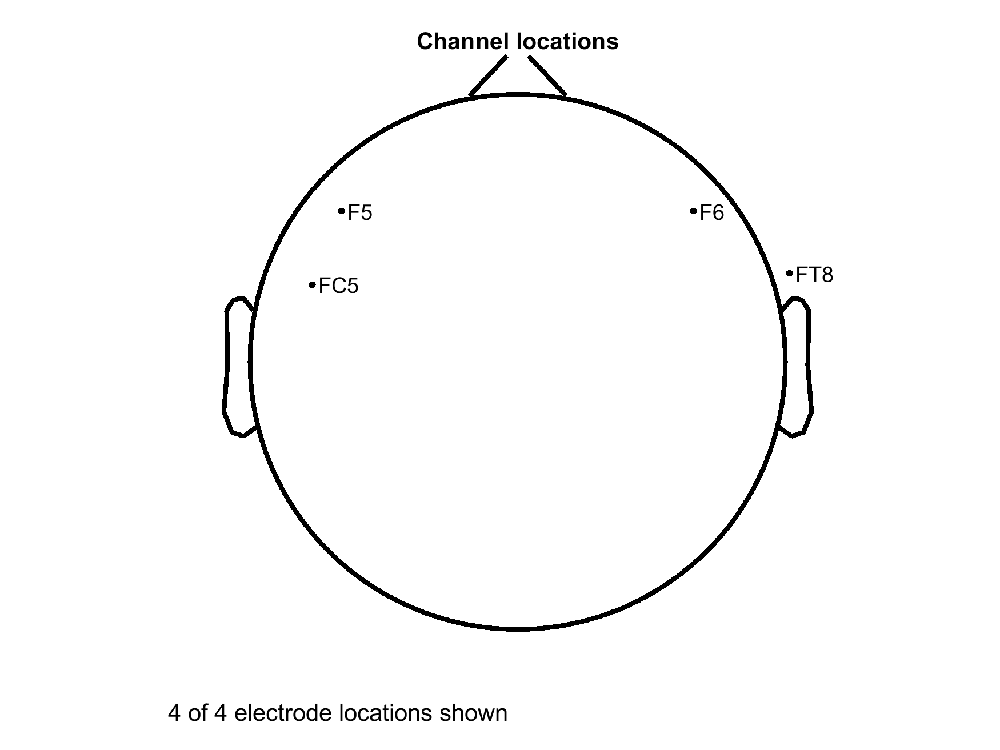
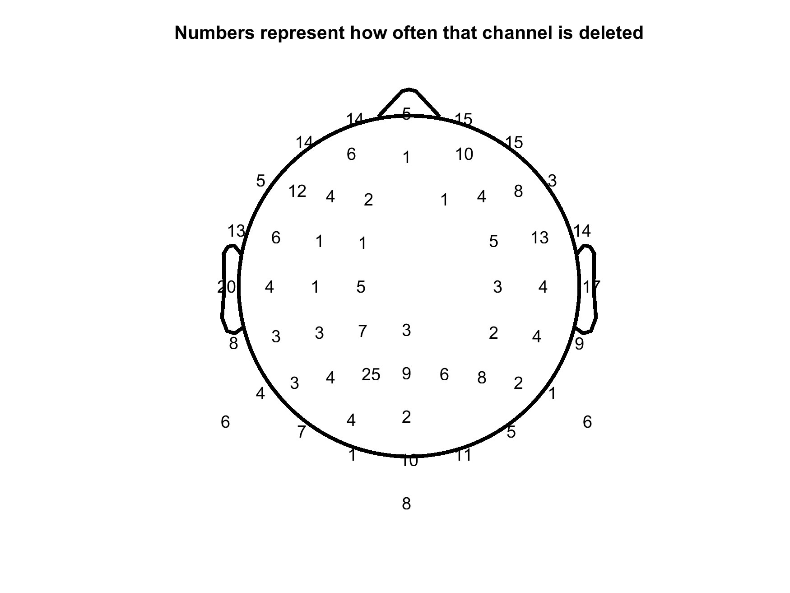

[](https://github.com/DouweHorsthuis/Plot_deleted_chan_eeglab/graphs/contributors) [](https://github.com/DouweHorsthuis/Plot_deleted_chan_eeglab/network/members) [](https://github.com/DouweHorsthuis/Plot_deleted_chan_eeglab/stargazers) [](https://github.com/DouweHorsthuis/Plot_deleted_chan_eeglab/blob/master/LICENSE.txt) [](https://www.linkedin.com/in/douwe-horsthuis-725bb9188/)

Made by [Douwe Horsthuis](https://github.com/DouweHorsthuis/) as part of the:


[Our lab's github page](https://github.com/CognitiveNeuroLab)

# Plotting channels that get deleted during the analysis

This are 2 functions that, on an individual level, plot which channels are deleted, or on a group level how often a channel got deleted. This should give some insight if data is trustworthy and of good quality. It is made for and needs EEGLAB.  
  
  
**Table of Contents**

1.  [About the project](#about-the-project)  
2.  [Functions explained](#functions-explained)
    -   [plot_deleted_chan_location](#readme_to_eeg)  
    -   [plot_group_deleted_chan_location](#ebridge)
3.  [Notes, shortcommings upcoming additions](#notes-shortcommings-upcoming-additions)

## About the project

As a part of building [a EEG pipeline that is scalable, well documented and reliable](https://github.com/DouweHorsthuis/EEG_to_ERP_pipeline_stats_R) we found the need to come up with a [quality analysis pipeline](https://github.com/DouweHorsthuis/Plot_deleted_chan_eeglab). These are both build while working with many members and former members of the [CNL at Albert Einstein College of Medicine](https://www.cognitiveneurolab.com/). This project resulted in some standalone functions that might be useful and should be made availible so not everyone needs to spend time on the same work. **Feel free to use it, and if you can please leave a comment ([douwehorsthuis\@gmail.com](mailto:douwehorsthuis@gmail.com)).**

One of the problems with EEG data is that due to the nature of data collection, it is not unlikely that channels that are close together malfunction at the same time. This might happen because the participant has an itch and touches the cap, because the participant might lean against something, because we overgell en bridge channels etc. On a individual level we want to make sure that we are not interpolating channels using bad channels. On a group level we want to make sure that our final ERP is not coming from the one channel that got deleted for most of our participants.

## Functions explained

Both functions require that you work in EEGLAB. Not just because that is the structure it expects, but also because it will pull functions from EEGLAB. **Please add to the [issues](https://github.com/DouweHorsthuis/Plot_deleted_chan_eeglab/issues) if you find other requirements**

To download the code you can [click here](https://github.com/DouweHorsthuis/Plot_deleted_chan_eeglab/archive/refs/heads/main.zip). The script you want to use is in the src folder, and you’ll also need the functions from the same folder.  
To download EEGLAB [go here](https://sccn.ucsd.edu/eeglab/download.php) and follow the instructions.

**important, urchanlocs** Both function require that the `EEG` structure has channel locations. While loading this it also requires that you create the `urchanlocs` which are the "original locations of channels". You can do this the following way. When you load channel locations like this: `EEG=pop_chanedit(EEG, 'lookup',[eeglab_location '\plugins\dipfit\standard_BESA\standard-10-5-cap385.elp'],'rplurchanloc',[1]);` The last part, `'rplurchanloc',[1]` is CRITICAL. This creates the `urchanlocs`.

### plot_deleted_chan_location

This is an example outcome:  
  
*Here you see that 4 electrodes are deleted for this participant*

The function works as followed:  
`[EEG]= plot_deleted_chan_location(EEG,save_path)`  
The input is the `EEG` structure that EEGLAB creates. `save_path` is the location to where you want to save your figure. The function looks for deleted channels, finds their original location and plots the name of the deleted channel in that location.

#### Why?

This allows you to see if the channels you deleted are all clustered and if interpolating this could become a problem.

### plot_group_deleted_chan_location

  
*Here you see for a group of 60 participants how often a channel got deleted, where P1 is a problem channel*  
  
This function works as followed: `[EEG, group_del_channel]= plot_group_deleted_chan_location(EEG,group_del_channel,save_path)`  
This function requires you to add `group_del_channel=[]` before you enter your participant loop.

``` matlab
eeglab
subject_list = {'12429' '12156' '12124'}; 
home_path    = 'C:\Users\dohorsth\Desktop\cystinosis\cued boss\data\'; 
group_del_channel=[]
for s=1:length(subject_list)
    fprintf('\n******\nProcessing subject %s\n******\n\n', subject_list{s});
    data_path  = [home_path subject_list{s} '\'];
    EEG = pop_loadset('filename', [subject_list{s} '_exchn.set'], 'filepath', data_path);
    [EEG, group_del_channel]=plot_group_deleted_chan_location(EEG,group_del_channel,home_path);
end
```

The function looks just like the previous one for deleted channels, instead of plotting the name, it counts how often this channel was deleted and plots that number. It uses the variable `group_del_channel` to keep track of this.

## Notes, shortcommings upcoming additions

If you have suggestions, edits, or issues, please leave them [here](https://github.com/DouweHorsthuis/Plot_deleted_chan_eeglab/issues), or e-mail me \@ [douwehorsthuis\@gmail.com](mailto:douwehorsthuis@gmail.com).

## Acknowledgements

-   [Douwe Horsthuis](https://github.com/DouweHorsthuis)  
-   [Sophie Molholm](https://www.einsteinmed.edu/faculty/12028/sophie-molholm/)
